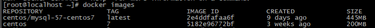

# docker


## 什么是docker

Docker 是一个开源项目，诞生于 2013 年初，最初是 dotCloud 公司内部的一个业余项目。它基于 Google 公司推出的 Go 语言实现。 项目后来加入了 Linux 基金会，遵从了 Apache 2.0 协议，项目代码在 GitHub 上进行维护。

Docker 自开源后受到广泛的关注和讨论，以至于 dotCloud 公司后来都改名为 Docker Inc。Redhat 已经在其 RHEL6.5 中集中支持 Docker；Google 也在其 PaaS 产品中广泛应用。

Docker 项目的目标是实现轻量级的操作系统虚拟化解决方案。 Docker 的基础是 Linux 容器（LXC）等技术。在 LXC 的基础上 Docker 进行了进一步的封装，让用户不需要去关心容器的管理，使得操作更为简便。用户操作 Docker 的容器就像操作一个快速轻量级的虚拟机一样简单。

下面的图片比较了 Docker 和传统虚拟化方式的不同之处，可见容器是在操作系统层面上实现虚拟化，直接复用本地主机的操作系统，而传统方式则是在硬件层面实现。

## docker优势

官方原文：Building and deploying new applications is faster with containers. Docker containers wrap up software and its dependencies into a standardized unit for software development that includes everything it needs to run: code, runtime, system tools and libraries. This guarantees that your application will always run the same and makes collaboration as simple as sharing a container image.

Docker containers whether [Windows](https://www.docker.com/products/windows-containers) or Linux are backed by Docker tools and APIs and help you build better software:

- Onboard faster and stop wasting hours trying to set up development environments, spin up new instances and make copies of production code to run locally.

- Enable polyglot development and use any language, stack or tools without worry of application conflicts.

- Eliminate environment inconsistencies and the "works on my machine" problem by packaging the application, configs and dependencies into an isolated container.

- Alleviate concern over application [security](https://www.docker.com/products/security)


译文：使用容器可以更快地构建和部署新应用程序。Docker容器将软件及其依赖关系整合到一个标准化的软件开发单元中，包括运行所需的一切：代码，运行时，系统工具和库。这可以保证您的应用程序始终运行相同，并使协作变得像共享容器映像一样简单。

Docker容器，无论是[Windows](https://www.docker.com/products/windows-containers)还是Linux都支持Docker工具和API，并帮助您构建更好的软件：

- 板载更快，并且不再浪费时间尝试设置开发环境，启动新实例并使生产代码的副本在本地运行。

- 启用多语言开发并使用任何语言，堆栈或工具，而无需担心应用程序冲突。

- 通过将应用程序，配置和依赖项打包到一个隔离的容器中，消除环境不一致和“在我的机器上工作”问题。

- 减轻对应用程序[安全性的](https://www.docker.com/products/security)担忧

  ### 为什么用docker

  #### 什么是容器（标准化的软件单元 :A standardized unit of software）


原文：**Package Software into Standardized Units for Development, Shipment and Deployment**

A container is a standard unit of software that packages up code and all its dependencies so the application runs quickly and reliably from one computing environment to another. A Docker container image is a lightweight, standalone, executable package of software that includes everything needed to run an application: code, runtime, system tools, system libraries and settings.

Container images become containers at runtime and in the case of Docker containers - images become containers when they run on [Docker Engine](https://www.docker.com/products/docker-engine). Available for both Linux and Windows-based applications, containerized software will always run the same, regardless of the infrastructure. Containers isolate software from its environment and ensure that it works uniformly despite differences for instance between development and staging.

Docker containers that run on Docker Engine:

- **Standard:** Docker created the industry standard for containers, so they could be portable anywhere
- **Lightweight:** Containers share the machine’s OS system kernel and therefore do not require an OS per application, driving higher server efficiencies and reducing server and licensing costs
- **Secure:** Applications are safer in containers and Docker provides the strongest default isolation capabilities in the industry

译文：将软件打包成标准化单元，用于开发，装运和部署

​		容器是一个标准的软件单元，它将代码及其所有依赖关系打包，以便应用程序从一个计算环境快速可靠地运行到另一个计算环境。Docker容器映像是一个轻量级，独立的可执行软件包，包含运行应用程序所需的一切：代码，运行时，系统工具，系统库和设置。

容器映像在运行时成为容器，在Docker容器的情况下 - 映像在[Docker Engine](https://www.docker.com/products/docker-engine)上运行时成为容器。适用于基于Linux和Windows的应用程序，无论基础架构如何，容器化软件都将始终运行相同。容器将软件与其环境隔离开来，并确保它可以统一运行，尽管开发和分段之间存在差异。

在Docker Engine上运行的Docker容器：

- **标准：** Docker创建了容器的行业标准，因此它们可以随处携带
- **轻量级：**容器共享机器的操作系统内核，因此不需要每个应用程序的操作系统，从而提高服务器效率并降低服务器和许可成本
- **安全：**应用程序在容器中更安全，Docker提供业界最强大的默认隔离功能


### 比较容器和虚拟机

原文：Containers and virtual machines have similar resource isolation and allocation benefits, but function differently because containers virtualize the operating system instead of hardware. Containers are more portable and efficient.

译文：容器和虚拟机具有类似的资源隔离和分配优势，但功能不同，因为容器虚拟化操作系统而不是硬件。容器更便携，更高效。

|                  |  |
| ------------------------------------------------------------ | ------------------------------------------------------------ |
| 虚拟机（VM）是物理硬件的抽象，将一台服务器转变为多台服务器。管理程序允许多台VM在单台机器上运行。每个VM都包含操作系统的完整副本，应用程序，必要的二进制文件和库 - 占用数十GB。虚拟机也可能很慢启动。（原文：Virtual machines (VMs) are an abstraction of physical hardware turning one server into many servers. The hypervisor allows multiple VMs to run on a single machine. Each VM includes a full copy of an operating system, the application, necessary binaries and libraries - taking up tens of GBs. VMs can also be slow to boot.） | 容器是应用层的抽象，它将代码和依赖关系打包在一起。多个容器可以在同一台机器上运行，并与其他容器共享操作系统内核，每个容器在用户空间中作为独立进程运行。容器占用的空间比VM少（容器映像的大小通常为几十MB），可以处理更多的应用程序，并且需要更少的VM和操作系统。（原文：Containers are an abstraction at the app layer that packages code and dependencies together. Multiple containers can run on the same machine and share the OS kernel with other containers, each running as isolated processes in user space. Containers take up less space than VMs (container images are typically tens of MBs in size), can handle more applications and require fewer VMs and Operating systems.） |

补充：在一起使用的容器和VM在部署和管理应用程序时提供了极大的灵活性。

## Docker引擎

docker引擎是一个c/s结构的应用


​	

- Server是一个常驻进程
- REST API 实现了client和server间的交互协议
- CLI 实现容器和镜像的管理，为用户提供统一的操作界面

## Docker构架

Docker使用C/S架构，Client 通过接口与Server进程通信实现容器的构建，运行和发布。client和server可以运行在同一台集群，也可以通过跨主机实现远程通信。


### Docker守护进程(Docker daemon)

原文：The Docker daemon (`dockerd`) listens for Docker API requests and manages Docker objects such as images, containers, networks, and volumes. A daemon can also communicate with other daemons to manage Docker services.

译文：Docker守护程序（`dockerd`）侦听Docker API请求并管理Docker对象，如图像，容器，网络和卷。守护程序还可以与其他守护程序通信以管理Docker服务。

### docker客户端(Docker client)

原文：The Docker client (`docker`) is the primary way that many Docker users interact with Docker. When you use commands such as `docker run`, the client sends these commands to `dockerd`, which carries them out. The `docker` command uses the Docker API. The Docker client can communicate with more than one daemon.

译文：Docker client（`docker`）是许多Docker用户与Docker交互的主要方式。当您使用诸如此类的命令时`docker run`，客户端会将这些命令发送给它们`dockerd`，然后执行这些命令。该`docker`命令使用Docker API。Docker客户端可以与多个守护进程通信。

### docker registries（注册中心）

A Docker *registry* stores Docker images. Docker Hub is a public registry that anyone can use, and Docker is configured to look for images on Docker Hub by default. You can even run your own private registry. If you use Docker Datacenter (DDC), it includes Docker Trusted Registry (DTR).

When you use the `docker pull` or `docker run` commands, the required images are pulled from your configured registry. When you use the `docker push` command, your image is pushed to your configured registry.

Docker *注册表*存储Docker镜像。Docker Hub是任何人都可以使用的公共注册中心，Docker配置为默认在Docker Hub上查找图像。您甚至可以运行自己的私人注册表。如果您使用Docker Datacenter（DDC），它包括Docker Trusted Registry（DTR）。

使用`docker pull`或`docker run`命令时，将从配置的注册表中提取所需的图像。使用该`docker push`命令时，图像将被推送到配置的注册表。

提示：注册中心网址：<https://hub.docker.com/>


## 使用部分

​	环境阿里云centos7

```li&#39;nu&#39;c
#在线安装docker社区版本（ce是社区版本意思）
yum install docker-ce 
#查看版本（用于检测是否安装完成）
docker -v  # 正确命令 docker version
```

​	**设置USTC的镜像位置（就相当于指定注册中心位置）**

​	ustc是老牌的linux镜像服务提供者了，还在遥远的ubuntu 5.04版本的时候就在用。ustc的docker镜像加速器速度很快。ustc docker mirror的优势之一就是不需要注册，是真正的公共服务。

<https://lug.ustc.edu.cn/wiki/mirrors/help/docker>


```
#编辑文件
vim /etc/docker/daemon.json
#在文件中添加 
{
"registry-mirrors": ["https://docker.mirrors.ustc.edu.cn"]
}
```

**启动，重启与停止**


```
#启动docker(也用于其他应用的启动) | systemctl命令是系统服务管理器指令
systemctl start docker
#停止docker（同实也可以停止其他应用）
systemctl stop docker
#重启docker（同操作）
systemctl restart docker
#查看ddocker(一样可以查看其他软件的状态)
systemctl status docker
#查看dockerinfo
docker info
#查看docker帮助
docker --help
```

**基本操作命令**

```
#查看镜像
docker images
```



| REPOSITORY（镜像名称） | TAG（镜像标签）                        | IMAGE ID（镜像ID） | CREATED（镜像的创建日期） | SIZE（镜像大小） |
| ---------------------- | -------------------------------------- | ------------------ | ------------------------- | ---------------- |
|                        | 由于镜像名称可能一样，主要用于版本区分 | 唯一标识           | 不是获取该镜像的日期      |                  |

注意：这些镜像都是存储在Docker宿主机的/var/lib/docker目录下

```
#在线搜素镜像
docker search 镜像名字
#拉取镜像
docker pull 镜像名称 # 例如：docker pull centos:7 #执行pull命令的时候要写完整的名字
#删除指定镜像
docker rmi 镜像ID
#删除所有本地镜像
docker rmi `docker images -q`
```

**查看容器**

```
#查看正在运行的容器
docker ps
#查看所有容器
docker ps –a
#查看最后一次运行的容器
docker ps –l
#查看停止的容器
docker ps -f status=exited
```

**容器的创建和启动**

​	执行规则：

创建容器命令：docker run

 -i：表示运行容器

 -t：表示容器启动后会进入其命令行。加入这两个参数后，容器创建就能登录进去。即分配一个伪终端。

 --name :为创建的容器命名。

 -v：表示目录映射关系（前者是宿主机目录，后者是映射到宿主机上的目录），可以使用多个－v做多个目录或文件映射。注意：最好做目录映射，在宿主机上做修改，然后共享到容器上。

 -d：在run后面加上-d参数,则会创建一个守护式容器在后台运行（这样创建容器后不会自动登录容器，如果只加-i -t两个参数，创建后就会自动进去容器）

 -p：表示端口映射，前者是宿主机端口，后者是容器内的映射端口。可以使用多个-p做多个端口映射


```
#交互式方式启动并且创建容器
# /bin/bash 表示 命令解释器二进制文件
docker run -it --name=容器名称 镜像名称:标签 /bin/bash 
#退出当前容器
exit
# 守护式方式创建容器
docker run -di --name=容器名称 镜像名称:标签
#登录守护式容器方式
docker exec -it 容器名称 (或者容器ID)  /bin/bash
#停止容器
docker stop 容器名称（或者容器ID）
#启动容器
docker start 容器名称（或者容器ID）
```

**文件拷贝**

```
#把文件拷贝到容器
docker cp 需要拷贝的文件或目录 容器名称:容器目录
#把容器文件拷贝到本地
docker cp 容器名称:容器目录 需要拷贝的文件或目录
```

**目录挂载**

```
#可以在创建容器的时候，将宿主机的目录与容器内的目录进行映射，这样我们就可以通过修改宿主机某个目录的文件#从而去影响容器  创建容器 添加-v参数 后边为 宿主机目录:容器目录
# 例子
docker run -di -v /usr/local/myhtml:/usr/local/myhtml --name=mycentos3 centos:7
# 如果共享的是多级的目录，可能会出现权限不足的提示。
# 这是因为CentOS7中的安全模块selinux把权限禁掉了，我们需要添加参数  --privileged=true  来解决挂# 载的目录没有权限的问题
```

**查看容器IP**

```
# 查看容器的所有数据
docker inspect 容器名称（容器ID）
# 格式化输出
 docker inspect --format='{{.NetworkSettings.IPAddress}}' 容器名称（容器ID）
```

**删除容器**

```
#删除指定容器
docker rm 容器名称（容器ID）
```

## 应用部署

 **MySQL部署**

```
# 1.拉取mysql镜像
docker pull centos/mysql-57-centos7
# 2.创建容器
# -p 代表端口映射，格式为宿主机映射端口:容器运行端口 -e 代表添加环境变量  MYSQL_ROOT_PASSWORD  # # 是root用户的登陆密码  
docker run -di --name=tensquare_mysql -p 33306:3306 -e MYSQL_ROOT_PASSWORD=123456 mysql
```

**tomcat部署**

```
# 拉取镜像
docker pull tomcat:7-jre7
# 创建容器  -v表示地址映射 格式为宿主机地址地址:容器地址位置
docker run -di --name=mytomcat -p 9000:8080 
-v /usr/local/webapps:/usr/local/tomcat/webapps tomcat:7-jre7
```

Nginx部署 | Redis部署 都一个套路

​	

```
docker pull nginx #拉取
docker run -di --name=mynginx -p 80:80 nginx # 创建
```

## 迁移与备份

```
# 容器保存镜像    docker commit 容器名称 备份后容器名称
docker commit mynginx mynginx_i
# 镜像备份 保存未tar文件
docker  save -o mynginx.tar mynginx_i
```

**镜像恢复**

```
# 镜像恢复  -i 输入的文件
docker load -i mynginx.tar
```

## Dockerfile

**常用命令**

| 命令                               | 作用                                                         |
| ---------------------------------- | ------------------------------------------------------------ |
| FROM image_name:tag                | 定义了使用哪个基础镜像启动构建流程                           |
| MAINTAINER user_name               | 声明镜像的创建者                                             |
| ENV key value                      | 设置环境变量 (可以写多条)                                    |
| RUN command                        | 是Dockerfile的核心部分(可以写多条)                           |
| ADD source_dir/file dest_dir/file  | 将宿主机的文件复制到容器内，如果是一个压缩文件，将会在复制后自动解压 |
| COPY source_dir/file dest_dir/file | 和ADD相似，但是如果有压缩文件并不能解压                      |
| WORKDIR path_dir                   | 设置工作目录                                                 |

**使用脚本创建镜像**

​	举例

```
# 创建目录
mkdir –p /usr/local/dockerjdk8
# 在此目录下载jdk8， jdk-8u171-linux-x64.tar.gz 可以使用wget或者本地上传

#创建文件Dockerfile 
vim Dockerfile


# 以下是创建的内容：
#依赖镜像名称和ID
FROM centos:7
#指定镜像创建者信息
MAINTAINER ITCAST
#切换工作目录
WORKDIR /usr
RUN mkdir  /usr/local/java
#ADD 是相对路径jar,把java添加到容器中
ADD jdk-8u171-linux-x64.tar.gz /usr/local/java/

#配置java环境变量 ：表示分隔符
ENV JAVA_HOME /usr/local/java/jdk1.8.0_171
ENV JRE_HOME $JAVA_HOME/jre
ENV CLASSPATH $JAVA_HOME/lib/dt.jar:$JAVA_HOME/lib/tools.jar:$JRE_HOME/lib:$CLASSPATH
ENV PATH $JAVA_HOME/bin:$PATH
# 内容结束

# 执行命令构建镜像 注意后边的空格和点，不要省略，.表示所有
docker build -t='jdk1.8' .
# 查看镜像是否建立完成（就是查看有没有这个镜像）
docker images
```

## Docker私有仓库


```
# 1.拉取私有仓库镜像（此步省略）
docker pull registry
#2. 启动私有仓库容器
docker run -di --name=registry -p 5000:5000 registry、
# 3.然后打开浏览器 输入地址http://ip地址:5000/v2/_catalog看到{"repositories":[]} 表示私有仓  #	库搭建成功并且内容为空 ，5000是映射的端口

# 4.修改daemon.json
	vim /etc/docker/daemon.json
	# 添加内容	 
	{"insecure-registries":["ip地址:端口"]}  # 此步用于让 docker信任私有仓库地址
	5.重启docker 服务
	systemctl restart docker
```

上传私有仓库

```
# 标记此镜像为私有仓库的镜像
docker tag jdk1.8 IP地址:端口/jdk1.8
# 再次启动私服容器
docker start registry
# 上传标记的镜像
docker push IP地址:端口/jdk1.8
```

